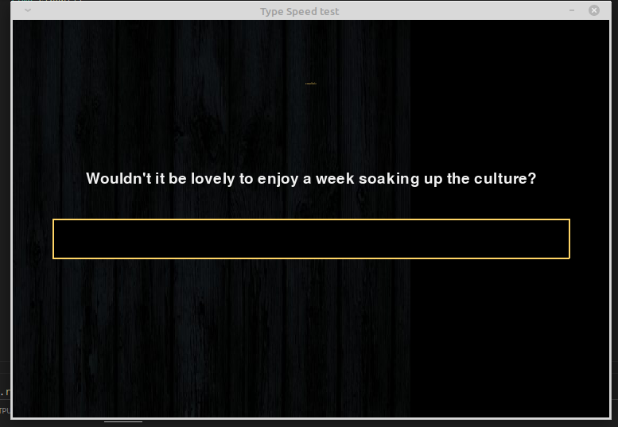
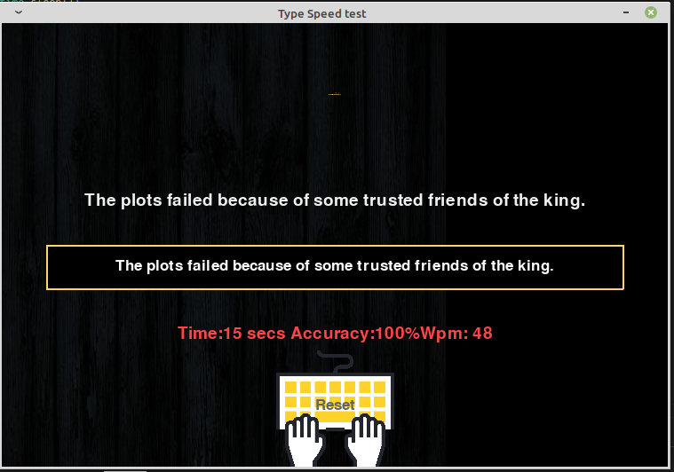

# <u>SPEED TEST GAME</u>  

This is a small game that enables a user to test his typing speed in real time. 
This project was built on top of the pygame libary. I took advantage of the pygame libary and  
created the whole project relaying on python OOP technique. 

 ## Note ## that the text to type are not much. 
 Feel free to fork this project and just re-modify it and add enough text to it. 

 

## Game start
 

## Game Played
 
